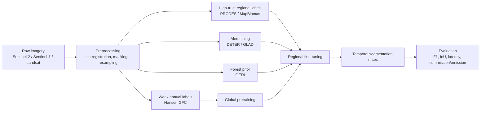

# Deforestation Monitoring with Satellite Imagery from 2024 to 2026

## Executive summary

The 2024–2026 literature is strong on **remote-sensing change detection**, but much thinner on **deforestation-specific temporal segmentation** with fully comparable benchmarks. In practice, the best current stack for a project that must emit **temporal segmentation maps of deforestation** is to combine open imagery from entity["organization","European Space Agency","space agency"] Sentinel-1/2 and entity["organization","U.S. Geological Survey","federal science agency"] Landsat with supervision from entity["organization","Instituto Nacional de Pesquisas Espaciais","Brazil research institute"] PRODES/DETER in entity["country","Brazil","south america"], annual Hansen/UMD loss labels, entity["organization","Global Forest Watch","forest monitoring platform"] / GLAD alert streams, and optional structure priors from entity["organization","NASA","space agency"] GEDI plus monthly tropical mosaics from entity["company","Planet Labs","earth imaging company"]’ NICFI programme. The most immediately usable model/repo combination is **ChangeMamba + Open-CD/torchange** for benchmarked segmentation, then regional fine-tuning on Brazil-specific labels. citeturn39search0turn40search3turn39search1turn43search2turn41search0turn41search4turn42search2turn43search10turn13search2turn44view0turn45view0

Two important caveats shape the whole field. First, most direct deforestation papers in this window are **operational monitoring** or **forest/non-forest segmentation** papers, not end-to-end dense **time-series event segmentation** papers. Second, the headline “SOTA” claims with the cleanest evidence are often on general change-detection benchmarks such as LEVIR-CD+, SYSU-CD, WHU-CD, SECOND, and OSCD rather than on deforestation-native benchmarks. So the most defensible interpretation of “SOTA for deforestation analysis” is: **use the best benchmarked temporal change models, then supervise/fine-tune them with deforestation-specific labels and evaluation protocols**. citeturn22view0turn26search0turn27search0turn31view1turn29view0turn19search0

The most actionable recommendation is to run a **two-stage programme**. Pretrain or initialise with a benchmarked bitemporal CD model such as ChangeMamba or an MTP-initialised U-Net, then fine-tune on a **Brazil-focused training set** built from Sentinel-2/Sentinel-1 imagery aligned with PRODES annual polygons, DETER/GLAD alerts for event timing, and MapBiomas land-cover context. If you need something operational immediately, add McGregor et al.’s 2024 near-real-time multi-source algorithm as a classical baseline; if you need stronger temporal robustness in cloudy tropics, incorporate Sentinel-1 and evaluate latency-to-detection explicitly, not just IoU/F1. citeturn17search1turn17search0turn16search0turn41search0turn41search4turn43search4turn13search2turn29view0

## The paper landscape

The table below separates papers that are **directly about deforestation monitoring** from papers that are **not deforestation-specific but are currently among the strongest temporal segmentation/change-detection methods to transfer into deforestation work**. For direct deforestation papers, “headline result” is reported exactly as surfaced in the accessible paper pages or official repo material; where a compact metric was not exposed in the accessible text, I say so explicitly rather than inventing one. citeturn17search1turn22view0turn26search0turn27search0turn30view0turn29view0turn19search0

| Paper | Authors | Venue | Year | Technical core | Temporal modelling | Training / losses / metrics | Headline result and baselines | Main limitations |
|---|---|---:|---:|---|---|---|---|---|
| **A multi-source change detection algorithm supporting user customization and near real-time deforestation detections** | McGregor et al. | Remote Sensing of Environment | 2024 | Classical, probabilistic near-real-time algorithm; combines harmonised z-scores across sources and supports user-tunable EWMA weighting. | Sequential monitoring with each new observation updating disturbance probability. | No deep-network training; operational change scoring. Paper emphasises detection accuracy vs latency trade-offs and user customisation. | The accessible paper summary stresses **high accuracy and fast detections**, but does not surface one compact benchmark figure in the snippet. Official paper states that the full code is archived in GitHub. citeturn17search1turn17search0turn17search2 | Not a dense deep segmentation model; performance is not reported against modern foundation-style CD backbones in the accessible snippet. |
| **Deep Learning-Driven Multi-Temporal Detection: Leveraging DeeplabV3+/Efficientnet-B08 Semantic Segmentation for Deforestation and Forest Fire Detection** | Joe Soundararajan et al. | Remote Sensing | 2025 | DeepLabV3+ decoder with EfficientNet-B08 encoder, ASPP with rates {1,6,12,18}, GroupNorm instead of BatchNorm, SE attention, four-band Sentinel-2 input. | Operational multi-temporal monitoring by repeated segmentation; not an explicit recurrent or transformer time-series architecture. | Adam, fixed lr 1e-4, binary focal loss, mixed precision, Albumentations (shared flips/rotations/brightness-contrast), 512×512 tiles, batch size 10; metrics include IoU, pixel accuracy, confusion matrices, PR/ROC and AUC. citeturn24view0turn23view3 | Validation IoU **0.9100** and pixel accuracy **0.9605** on the Amazon/Atlantic forest dataset. Against earlier cross-region baselines, the paper reports Attention-U-Net at **F-score 0.9021 / IoU 0.8143** and plain U-Net at **0.9005 / 0.8254** in one direction; their own model reports **F-score 0.9490, IoU 0.9100** and in the reverse direction **F-score 0.9537, IoU 0.9124**. citeturn22view0turn24view0turn37view1 | The label is essentially **forest vs non-forest**, so it is closer to repeated land-cover segmentation than to timestamped event segmentation. The article mentions a public GitHub release, but I did not locate a surfaced official repo page in the sources reviewed. |
| **Deep-learning deforestation detection in the Legal Amazon area based on Sentinel-1 data** | Renam Silva et al. | Remote Sensing Applications: Society and Environment | 2025 | Bi-temporal Sentinel-1 SAR semantic-segmentation framing: earlier image for forest detection, later image for deforestation. Strong fit for rainy-season, cloud-robust monitoring. | Bi-temporal rather than long-sequence; explicitly designed for year-round monitoring under cloud cover. | Accessible abstract-level text does not expose the full training recipe or compact benchmark table. | The accessible abstract says the method is effective at flagging new Amazon deforestation with bi-temporal SAR and highlights fewer temporal acquisitions than long time-series methods. citeturn16search0turn26search0 | In the surfaced text I could not recover a compact headline F1/IoU table or an official code repository. |
| **On the sensitivity of SAR C- and L-band dual-polarized data for detection of early deforestation in the tropics** | Africa I. Flores-Anderson et al. | Remote Sensing of Environment | 2026 | Sensor-analysis paper rather than a deep net: compares Sentinel-1 C-band and ALOS-2 PALSAR-2 L-band, uses RFDI / modified RFDI, QDA, RF and decision trees across 92 locations and three deforestation stages. | Explicit stage-wise time-series analysis of **early logging → burning / clearing → regrowth**. | Statistical classification and separability analysis; not end-to-end dense neural segmentation. | Strongest conclusion is qualitative but operationally important: **L-band RFDI is highly sensitive to early deforestation**, while **C-band is stronger for later stages** after biomass removal. citeturn27search0 | No public code surfaced; data availability is “on request”; not a deployable dense segmentation model. |
| **ChangeMamba: Remote Sensing Change Detection With Spatiotemporal State Space Model** | Hongruixuan Chen et al. | IEEE TGRS | 2024 | Visual Mamba encoder plus three spatio-temporal relationship modules; variants for binary CD, semantic CD and building-damage assessment. | Bitemporal spatio-temporal interaction in the decoder; linear-complexity state-space modelling of global context. | AdamW, lr 1e-4, weight decay 5e-3, batch 16, 20k iterations on SYSU and 50k on the remaining datasets; augmentations are random rotation, left-right and top-bottom flips; BCD metrics include Rec/Pre/OA/F1/IoU/Kappa. citeturn32view1turn30view0 | Best-reported F1 scores are **83.11** (SYSU), **88.39** (LEVIR-CD+), **94.19** (WHU-CD), plus **24.11 SeK** on SECOND and **81.41 overall F1** on xBD. On LEVIR-CD+, MambaBCD-Base reaches **F1 88.39 / IoU 79.20**, ahead of SwinSUNet at **85.60 / 74.82**. The paper also notes that MambaBCD-Tiny beats BIT-18 while using **56.9% fewer GFLOPs**. citeturn31view2turn32view0turn32view2 | Not deforestation-specific; evaluated on generic CD benchmarks. It is the best transfer candidate rather than a direct forest-loss paper. |
| **MTP: Advancing Remote Sensing Foundation Model via Multi-Task Pretraining** | Di Wang et al. | IEEE JSTARS | 2024 | Shared encoder plus task-specific decoders; supervised multi-task pretraining on SAMRS for semantic segmentation, instance segmentation and rotated detection, then finetuning to downstream tasks including change detection. | Temporal modelling is delegated to the downstream CD head (here, U-Net over paired images) rather than learned as a bespoke sequence model. | Multi-task supervised pretraining, then downstream finetuning. Repo exposes configs, logs and checkpoints; environment is OpenMMLab-heavy and largely SLURM-oriented. citeturn35search0turn29view0 | In change detection finetuning, the repo reports **F1 55.92** on OSCD, **94.75** on WHU, **92.67** on LEVIR and **97.98** on SVCD/CDD for the ViT-L+RVSA + UNet variant. citeturn29view0 | Not a deforestation paper; temporal reasoning is modest compared with dedicated CD architectures. The main value is strong initialisation for downstream fine-tuning. |
| **SChanger: Change Detection from a Semantic Change and Spatial Consistency Perspective** | Ziyu Zhou et al. | IEEE JSTARS | 2025 | Semantic Change Network: single-temporal supervised pretraining, shared-weight Siamese design, extended Temporal Fusion Module, plus a spatial-consistency attention map from large-kernel convolutions. | Explicit bitemporal semantic transfer with spatial consistency induction. | Accessible summaries expose architecture and benchmark metrics, but not the full loss/training recipe in the surfaced sources reviewed. | The paper reports F1 scores of **92.87** (LEVIR-CD), **86.43** (LEVIR-CD+), **68.95** (S2Looking), **97.62** (CDD), **84.58** (SYSU-CD) and **93.20** (WHU-CD), describing gains over all benchmark methods on those datasets. citeturn19search0turn19search2 | I did not locate an official public code repository in the surfaced sources. Again, it is a transfer candidate rather than a direct forest-loss paper. |

A crucial synthesis point follows from the table. If your project is about **deforestation through time**, the direct deforestation papers tell you what matters operationally: cloud robustness, low detection latency, stage awareness, and differentiation between true forest loss and phenological or degradation confounders. The benchmarked SOTA CD papers tell you what matters architecturally: better paired-image feature interaction, global context, and stronger pretraining. The best system will borrow from both strands. citeturn16search0turn27search0turn31view2turn29view0turn19search0

## Code and reproducibility

For immediate experimentation, the most useful repos are not necessarily the ones attached to the direct deforestation papers; they are the ones that already expose training scripts, configs, checkpoints, and benchmark coverage. That is why the strongest practical path is usually **an official model repo plus a benchmark toolbox** rather than a one-off paper implementation. citeturn13search2turn13search1turn44view0turn45view0turn17search0

| Repo / implementation | What it gives you | Maturity | Reproducibility notes |
|---|---|---|---|
| **ChangeMamba official repo** | Official code for MambaBCD / MambaSCD / MambaBDA, training and inference scripts, checkpoints, SECOND preprocessing help, Zenodo / drive weights. | **589 stars**, **43 forks**, repo history shows **100 commits**; GitHub topic crawl surfaced **Updated 1 Jun 2025**, while the repo README documents updates through **30 Mar 2026**. citeturn10view5turn10view4turn15search1 | Very usable. The repo explicitly warns that the reorganised code may not **perfectly match the original paper** and may even score **higher** than the paper in some settings, so treat reproduced numbers and paper numbers as related but not identical. citeturn13search2 |
| **MTP official repo** | Pretrained backbones, finetuned checkpoints, configs and logs across tasks, including CD; easy way to test whether stronger RS pretraining helps your forest-loss task. | **249 stars**, **14 forks**, **42 commits**; org crawl shows **Updated 4 Aug 2025**. citeturn10view0turn10view1turn13search3 | Good artefact coverage, but the training stack is heavier and more infrastructure-dependent than ChangeMamba, with SLURM examples and a broad OpenMMLab dependency graph. citeturn29view0turn13search1 |
| **Open-CD** | Comprehensive toolbox with many CD baselines and datasets; ideal for apples-to-apples comparisons and benchmark hygiene. | **846 stars**, **106 forks**, **158 commits**; topic crawl shows **Updated 15 Nov 2025**. citeturn44view0turn21search0 | Best choice for controlled baselines. It supports many canonical CD models and datasets, but it is a toolbox, not a deforestation-specialised package, so you must wire in your own forest-loss data engineering. citeturn44view0 |
| **torchange / pytorch-change-models** | Emerging benchmark library for contemporary change modelling, including probabilistic change models, AnyChange, Changen2 and more. | **235 stars**, **20 forks**; **185 commits**; latest GitHub release **v0.0.4 on 31 Jan 2026**; PyPI status marked **beta**. citeturn45view0turn18search4turn18search5 | Promising and increasingly practical, but still explicitly **under development** and API-stable only in a limited sense. Good for rapid experimentation, less ideal for fully locked-down production baselines. citeturn45view0 |
| **ncsuSEAL/McGregor-et-al-2024** | The rare direct-deforestation 2024 repo with code and sample data attached to the paper. | Organisation listing shows repo updated **24 Jun 2024** and roughly **6 stars**. citeturn17search0turn17search2 | Excellent as an operational NRT classical baseline and for latency comparisons; not a modern neural segmentation training framework. citeturn17search1turn17search0 |
| **CSSM / Change State Space Models** | New 2025 state-space CD repo linked from the paper ecosystem. | Surfaced ecosystem pages show about **5 GitHub stars** and visible activity through **4 Nov 2025**. citeturn36search1turn36search0 | Interesting research code, but visibly less mature than ChangeMamba or Open-CD. I would not make it the first production baseline. |

The reproducibility hierarchy is therefore clear. For a first serious experimental sprint, I would rank repos as **Open-CD for benchmarking discipline**, **ChangeMamba for the strongest direct model starting point**, **MTP for representation transfer**, **torchange for fast comparative breadth**, and **McGregor-et-al-2024** as the classical operational baseline you want in every results table. citeturn44view0turn13search2turn13search1turn45view0turn17search0

## Data sources and datasets

The right data stack has three layers: **raw imagery**, **dense annual labels**, and **near-real-time alerts / weak labels**. The largest mistake in deforestation projects is to use only one of these. Annual labels are good for stable supervision; alerts are good for event timing; raw multi-sensor imagery is good for learning the actual segmentation. citeturn39search0turn40search3turn39search1turn43search2turn41search0turn41search4

### Foundational imagery and label sources

| Source | What it provides | Resolution / cadence | Labels or annotations | Access / licence situation | Why it matters |
|---|---|---|---|---|---|
| **Sentinel-2** | 13-band multispectral optical imagery. | **10 m** headline resolution, **13 bands**, **5-day revisit**. citeturn39search0turn39search4 | No labels. | Official access via the Copernicus ecosystem; practical default for optical forest monitoring. citeturn39search0turn39search4 | Best open optical backbone for dense forest-loss segmentation. |
| **Sentinel-1** | C-band SAR, all-weather / day-night imagery. | Two-satellite constellation images Earth every **six days**; IW mode is **5×20 m** at **250 km** swath. citeturn40search1turn40search3 | No labels. | Official access via Copernicus / ESA. citeturn40search0turn40search3 | Essential for cloudy tropics and rainy-season monitoring. |
| **Landsat Collection 2 Level-2** | Long-horizon surface reflectance and temperature archive. | Global Level-2 SR/ST from **1982 to present**; Landsat multispectral imagery is the canonical **30 m** source for most annual forest-change products. citeturn39search1turn39search3turn41search0turn43search2 | No labels. | **No-cost open data** via USGS. citeturn39search1turn39search3 | Best long baseline for annual change history and model pretraining. |
| **GEDI L2A / L4A** | Spaceborne lidar footprints with canopy structure and biomass density. | Approx. **25 m footprints** sampled along track; L4A v2.1 covers **2019-04-17 to 2024-11-27**. citeturn40search6turn42search2 | Height metrics, canopy vertical structure, AGBD and uncertainty. citeturn40search6turn42search2 | NASA Earthdata states the data are openly shared / without restriction under EOSDIS guidance. citeturn42search2 | Excellent weak prior for “is this pixel actually forest?” and for filtering pseudo-loss in low-stature vegetation. |
| **Hansen Global Forest Change v1.12** | Annual global tree-cover loss and tree-cover-2000 layer from Landsat time-series. | **30.92 m** pixels, **2000–2024**. citeturn43search2 | Annual year-of-loss label, tree cover in 2000, gain 2000–2012. citeturn43search2 | **CC-BY-4.0** in the Earth Engine catalogue. citeturn43search2 | Best global dense annual supervision layer; noisy for exact timing, but extremely useful for pretraining and weak supervision. |
| **GLAD-L / GLAD-S2 alerts** | Near-real-time forest-loss alerts. | GLAD-L uses Landsat at **30 m**; GLAD-S2 uses Sentinel-2 at **10 m** in primary humid tropical forest in the Amazon basin; updates are driven by new clear observations. citeturn41search0 | Alert pixels, not full “final area estimate” labels. | Official GLAD access; free to use, but GLAD explicitly warns against using alerts as direct area estimates. citeturn41search0 | Best timing signal for event discovery, hard-negative mining, and latency evaluation. |
| **PRODES / DETER via TerraBrasilis** | Official Brazilian forest-monitoring spatial data and downloads. | PRODES is annual deforestation mapping; DETER is alert-based monitoring. TerraBrasilis exposes vector/raster downloads and web services. citeturn41search4 | Official Brazil monitoring outputs. | Public portal, downloads and services available; the landing page surfaces access strongly, but explicit reuse terms are less prominent than for Hansen or MapBiomas. citeturn41search4 | If your target geography includes the Brazilian Amazon, these should be your highest-trust supervision and alert sources. |
| **MapBiomas** | Brazil-wide annual land-cover/use maps, deforestation and secondary vegetation layers, Landsat mosaics, validation points and 10 m beta products. | Annual collections since **1985**; latest platform lists land-use/cover **Collection 10.1** and other thematic collections. citeturn43search4turn43search9 | Multi-class land-cover labels, validation points, ancillary layers. | Data are public and open under **CC-BY / CC-BY-SA** depending on page/context. citeturn43search0turn43search3 | Best contextual label source in Brazil for distinguishing deforestation from crop cycles, pasture expansion, water and urban transitions. |
| **Planet NICFI basemaps** | Monthly tropical mosaics and biannual archive mosaics. | Programme-level monthly monitoring mosaics for the tropics. citeturn43search10 | No direct labels. | Public visual access exists; downloadable SR mosaics are programme-gated by access level. citeturn43search10 | Very useful for manual refinement, QA and small-object boundary clean-up in tropical regions. |

### Ready-made segmentation dataset for immediate prototyping

The most useful ready-made open dataset for a first smoke test is not a native “deforestation event” dataset, but the **Amazon and Atlantic Forest image datasets for semantic segmentation** from Zenodo. It consists of four-band Sentinel-2 Level-2A chips (bands 4/3/2/8) with forest/background masks, with **499 Amazon** and **485 Atlantic Forest** training images, **100** validation images per biome, and **20** test images per biome, all at **512×512**. It is open in Zenodo and is exactly the dataset reused in the 2025 DeepLabV3+/EfficientNet-B08 paper. citeturn38search0turn37view1

That dataset is excellent for **pipeline validation, augmentation debugging, loss balancing and early convergence testing**, but it is **not enough by itself** for event-time deforestation segmentation. It gives you a forest mask, not a timestamped change target. Treat it as a warm-up dataset or a pre-finetuning segmentation auxiliary task. citeturn38search0turn22view0

## Data strategy for temporal deforestation segmentation

A workable project-level strategy is to treat deforestation segmentation as a **multi-source temporal labelling problem**, not just a model-selection problem. The papers and datasets above imply four design rules. First, use **optical plus SAR** whenever clouds matter. Second, build labels that combine **annual high-confidence polygons** with **near-real-time alert timing**. Third, encode **phenology / seasonality** explicitly, especially outside the evergreen humid tropics. Fourth, measure **latency**, not only IoU. citeturn16search0turn27search0turn24view1turn41search0

The dataset combination I would recommend is:

1. **Global pretraining layer**  
   Pair Sentinel-2 and Landsat chips with Hansen v1.12 annual loss labels. Use this for broad, noisy supervision over many forest regimes. Keep the target binary at first: deforested this year vs not. This teaches rough loss morphology and boundaries. citeturn39search0turn39search1turn43search2

2. **Brazil refinement layer**  
   Fine-tune on Sentinel-2 plus Sentinel-1 tiles aligned with PRODES polygons, DETER alerts, and MapBiomas context. PRODES should dominate the **polygon truth**, DETER/GLAD should dominate the **time-of-first-detection**, and MapBiomas should dominate the **context prior** used to suppress pasture/crop confusions. citeturn41search4turn43search4turn43search9turn41search0

3. **Structure / biomass prior layer**  
   Use GEDI footprints to reject pseudo-forest and enforce that “deforestation” is being learned primarily in places that were structurally forested before loss. This is especially valuable when Hansen / alerts include ambiguous low-stature vegetation or plantations. citeturn40search6turn42search2

4. **Manual refinement / QA layer**  
   Use Planet NICFI monthly mosaics for spot checks, label cleaning and boundary refinement on a much smaller subset. This is where you fix roads, edge bleed, selective-logging boundaries and cloud artefacts. citeturn43search10

The preprocessing stack should be conservative and temporally aware. Use surface reflectance imagery where available; co-register all modalities to a common grid; for optical data, apply cloud/shadow masking and keep a validity mask per timestamp; for SAR, use radiometrically terrain-corrected backscatter where possible and retain orbit/incidence metadata. Resample to a common target scale, typically **10 m** if Sentinel-2 / Sentinel-1 are primary, or **30 m** if you prioritise global Landsat/Hansen training scale. Build fixed-length windows such as 2, 3, 6 or 12 timestamps, and attach day-of-year or month embeddings so the model can distinguish phenology from real loss. These recommendations are directly consistent with what the papers emphasise: Sentinel-2 four-band segmentation, Sentinel-1 for cloudy-season robustness, RF phenology features in data-scarce settings, and stage-aware SAR response analysis. citeturn24view0turn16search0turn24view1turn27search0

The augmentation policy should be **time-consistent for geometry** and only **partially independent for photometry**. In practice, I would apply the same crop, flip and rotation to every timestamp in a window, then light per-timestamp brightness/contrast jitter for optical data, missing-observation dropout to simulate cloud gaps, low-frequency haze or cloud-mask corruption for robustness, and SAR-specific mild speckle / intensity perturbation. This is a direct synthesis of the cited training regimes: the 2025 DeepLab paper uses flips, rotations, affine perturbation and brightness/contrast jitter on Sentinel-2, while ChangeMamba uses rotation and flips for paired imagery. citeturn24view0turn32view1

One warning is especially important: **do not use GLAD alerts as an area-estimation label set**. GLAD themselves describe the alert systems as early indicators intended to complement annual products and state that they should not be used to produce area estimates. That makes them perfect for **sampling positive candidates, hard-negative mining and latency scoring**, but not as the sole dense target mask. citeturn41search0

## Prioritised shortlist and experimental plan

If I had to choose only a few components for immediate work, I would prioritise the following.

**Methods**
- **ChangeMamba** as the first strong temporal segmentation baseline. It has the cleanest combination of strong benchmark results, official code, training scripts and checkpoints. citeturn31view2turn13search2
- **MTP-initialised U-Net or ChangeMamba encoder initialisation** as the first “representation transfer” experiment. citeturn29view0turn13search1
- **McGregor-et-al-2024** as the operational, inexpensive non-deep-learning baseline. citeturn17search1turn17search0

**Repos**
- **Open-CD** for benchmark hygiene and ablations. citeturn44view0
- **torchange** for rapid comparative breadth and modern change-learning add-ons. citeturn45view0turn18search4

**Datasets / sources**
- **Sentinel-2 + PRODES + DETER + MapBiomas** for Brazil-first training. citeturn39search0turn41search4turn43search4turn43search9
- **Hansen GFC + GLAD-L/S2 + Sentinel-2 / Landsat** for global weak supervision and timing. citeturn43search2turn41search0turn39search1turn39search0
- **Sentinel-1** for cloudy-season robustness. citeturn40search1turn16search0
- **Bragagnolo Amazon/Atlantic dataset** for immediate smoke tests. citeturn38search0turn37view1

The workflow below is the one I would actually run first, because it keeps the label hierarchy clean and makes latency a first-class evaluation target instead of an afterthought. citeturn41search0turn41search4turn43search2turn13search2turn44view0

The minimum experimental plan I would trust has four runs.

**Run one: the disciplined baseline.**  
Use Open-CD with a plain Siamese or Changer-style baseline on a Brazil subset. Inputs: two timestamps only, Sentinel-2, 256 or 512 crops. Labels: PRODES annual polygons snapped to the later image date. Goal: establish a clean, reproducible baseline and a first compute budget. citeturn44view0turn41search4

**Run two: the strongest bitemporal model.**  
Swap in ChangeMamba with the same splits, same crops, and the same evaluation. Add Sentinel-1 as a second stream only after the pure optical run is stable. This tells you how much you gain from state-space temporal modelling before you complicate the data stack. citeturn32view1turn31view2turn13search2

**Run three: the alert-aware temporal model.**  
Convert the task from “before vs after annual loss” to a short sequence. Construct 3- to 6-step monthly or quarterly windows, use DETER/GLAD to identify the first positive interval, and train a model to emit a segmentation for each step or for the first-loss step. If you need a practical shortcut, start by running ChangeMamba pairwise over sliding windows and then apply temporal smoothing or first-hit logic. This is not academically elegant, but it is often the fastest way to a robust operational system. citeturn41search0turn41search4turn13search2

**Run four: the representation-transfer test.**  
Initialise from MTP-pretrained backbones and compare against ImageNet or random initialisation on the exact same forest-loss task. This directly answers whether remote-sensing foundation pretraining is paying off on your geography and label regime. citeturn29view0turn13search1

For evaluation, I would not stop at pixel F1 and IoU. Keep those, because the literature uses them heavily, but add **latency to first correct detection**, **polygon IoU**, **omission / commission by biome**, and **false-alarm rate over stable forest**. ChangeMamba reports the standard BCD suite of recall, precision, OA, F1, IoU and Kappa; the direct deforestation papers remind us that operational value depends just as much on *when* you detect the disturbance and whether you confuse logging, burning, regrowth and seasonal shifts. citeturn32view1turn27search0turn24view1

The compute estimate below is an inference from the cited configs and reported hardware, not a paper-quoted “requirement”. A realistic setup for early experiments is **1×24 GB to 1×40 GB GPU** for 256–512 crops. The 2025 DeepLab/EfficientNet paper reports a single **A100 40 GB**, batch size **10** on **512×512** tiles, using about **17 GB** during training and less than **7 GB** in inference. ChangeMamba trains with **batch 16** on **256×256** crops and 20k/50k iteration regimes. MTP’s full pretraining is substantially heavier and assumes multi-GPU / SLURM-style execution, so I would treat MTP primarily as a checkpoint source rather than something to re-pretrain from scratch in a first pass. citeturn37view1turn24view0turn32view1turn29view0

The bottom line is straightforward. If you want the **best immediate experimental stack**, start with **ChangeMamba + Open-CD**, train on **Sentinel-2 + PRODES/MapBiomas**, add **GLAD/DETER** for timing, then fold in **Sentinel-1** for cloudy-season robustness. If you want the **best medium-term research stack**, keep that pipeline but add **MTP initialisation**, **GEDI-derived forest priors**, and a **short-sequence temporal supervision regime** rather than pure bitemporal pairing. That combination is the clearest path from benchmark-grade CD to a genuinely useful deforestation-monitoring system. citeturn13search2turn44view0turn29view0turn42search2turn41search0turn41search4turn43search4